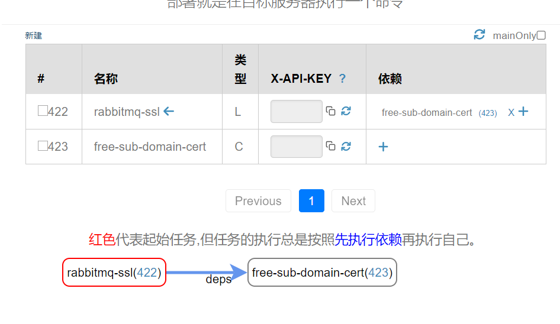

## Template Rabbitmq-ssl

This template will install a rabbmitmq server on your server. Using nginx to proxy the webui and the amqp.

### What's created?

* a domain like y10.free-ssl.me
* a Domain object in our system which will update the ssl certification automatically.
* and a running rabbitmq server on your server.

### after using this templat.


The settings of the free-sub-domain-cert:

```json
{
  "domain_id": 333,
  "ip_address": "192.168.0.1",
  "domain_name": "y10.free-ssl.me."
}
```
**change the ip_address to your server.**, after hit the update button, the dns will take effect immediately.

**COPY THE PUBLIC SSHKEY TO YOUR SERVER** or else nothing will happen in your server.


the settings of the rabbitmq-ssl:

```json
{
  "connection": {
    "host": "y10.free-ssl.me", // change this to the subdomain showed above.
    "port": 22,
    "user": "azureuser", // adjust the name.
    "workingdir": "/home/azureuser",
    "sudo": true,
    "exec": false,
    "sshkey_id": 45 // copy the sshkey's public key to your server.
  },
  "mustache": {
    "scopes": { // template will add extra value to this place.
      "rabbitmqAdminName": "rabbitmqAdminName",
      "rabbitmqAdminPassword": "rabbitmqAdminPassword"
    },
    "templates": [
      {
        "template": "nginx-1.18.0.conf",
        "scopes": {}
      },
      {
        "template": "setup-nginx.sh",
        "scopes": {}
      },
      {
        "template": "setup-rabbitmq.sh",
        "scopes": {}
      }
    ]
  }
}
```